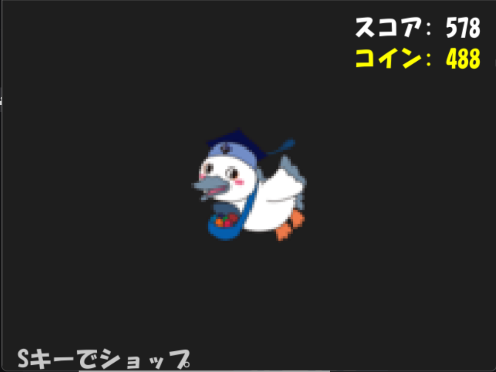
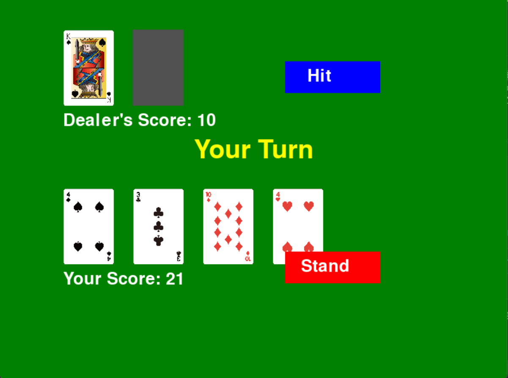
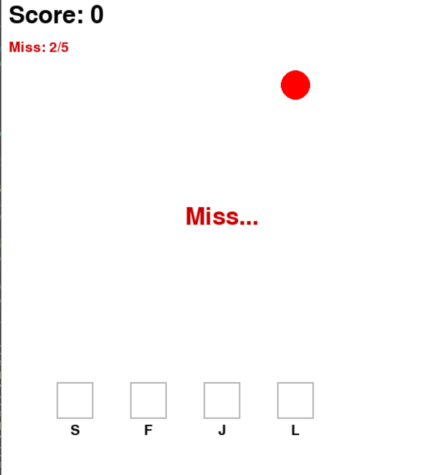
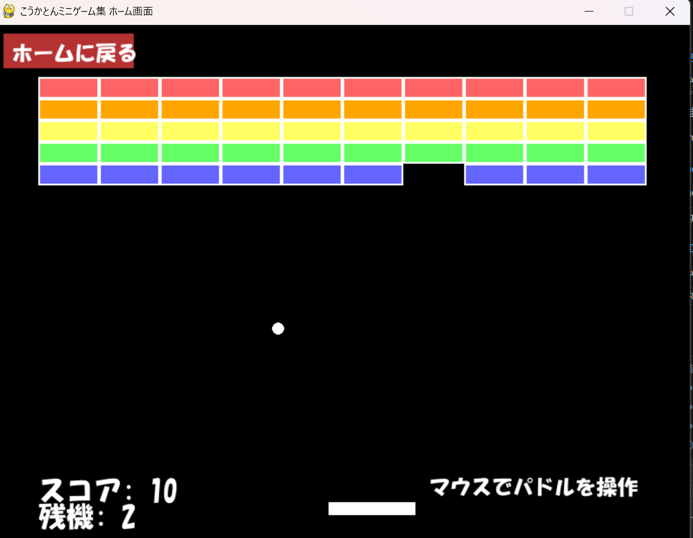
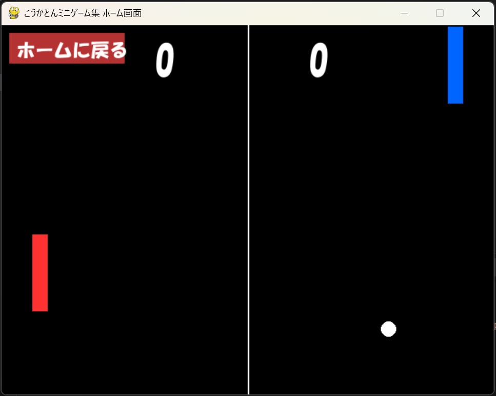
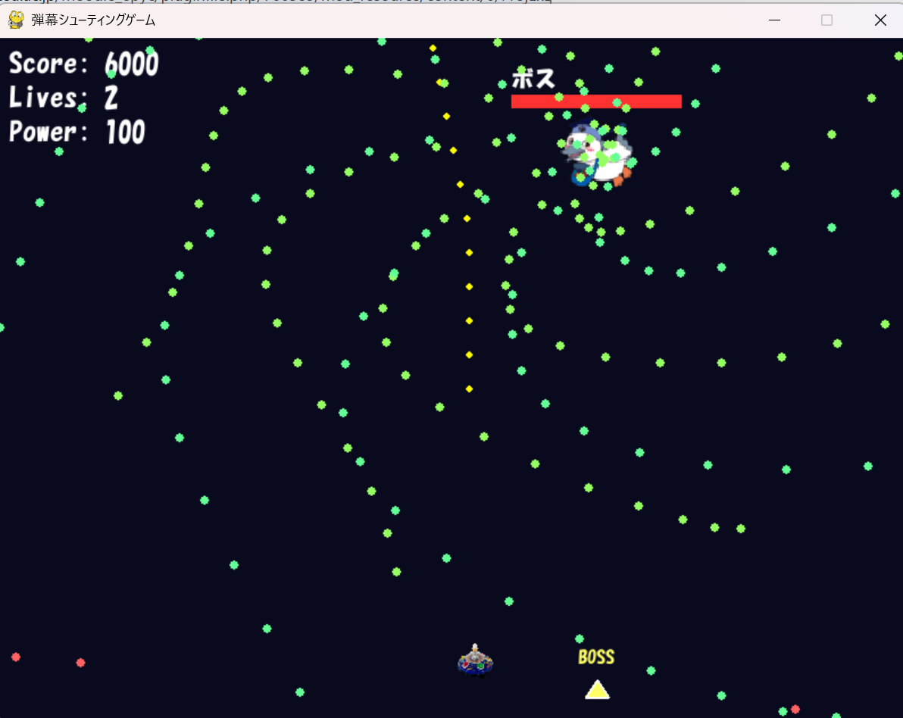

# ミニゲーム集

## 実行環境の必要条件
* python >= 3.10
* pygame >= 2.1

## ゲームの概要
* いくつかのミニゲームを遊べる。⇒クリッカー、ブラックジャック、リズム、ブロック崩し、ホッケー、弾幕シューティング
* 参考URL：[ニンテンドーランド](https://www.nintendo.co.jp/wiiu/alcj/index.html)

## ゲームの遊び方
* ホームからミニゲームを選択
* ゲーム1・クリッカー:画面中央のこうかとんをクリックするとスコアとコインが増える。Sキーを押すと開くショップで、コインを使ってオート機能とクリック時スコア増加が購入できる。スコアが1000になるとクリア。
* ゲーム2・ブラックジャック:通常のブラックジャックと同じく、トランプの数を合わせて21に近づける。21を超えると強制終了。Hitボタンをクリックすると1枚引け、Standボタンをクリックするとディーラーの番になる。ディーラーは17以上の数になるまで引き続け、17以上になると強制的にstandする。最終的にディーラーと自分の数の合計を競う。
* ゲーム3・リズム:上から落ちてくる赤いノーツ（丸）が、判定ライン（画面下の四角）に重なった瞬間に、S/F/J/Lキーのうち対応するキーを押す。タイミングが合えば”Perfect!”判定、タイミングがずれるorノーツを見逃すと”Miss...”となり、ミス数が増加。全20個のノーツがあり、それが終わると自動で終了。ミスが5回以上になるとゲームオーバー。ノーツをすべて処理するとクリア。
* ゲーム4・ブロック崩し:ホーム画面では矢印キーで黄色いキャラを操作し、「ブロック崩し」と書かれたゲートに触れるとゲーム選択画面に進む。「スタート」をクリックするとゲーム開始。パドル（白いバー）を左右キーで操作して、ボールを跳ね返しながら上部のブロックをすべて壊す。すべて壊せばクリア、ボールが下に落ちるとゲームオーバー。クリアまたはゲームオーバー後、Rキーで再スタート。
* ゲーム5・ホッケー:マウスカーソルでラケットを動かし、球を打つ。相手側の壁に球を当てたらポイント。相手より先に5点取ったほうの勝ち。
* ゲーム6・シューティング:矢印キーで自機を上下左右に移動し、Zキーで弾を発射する。雑魚敵を倒し、最後に登場するボスを撃破するとゲームクリア。敵や弾に3回当たるとゲームオーバー。スコアは敵を倒すごとに加算される。

## ゲームの実装
### 共通基本機能
* ホーム画面
* ホーム遷移機能

### 分担追加機能
* ゲーム1:C0A23040　加藤竜馬
* ゲーム2:C0A24044　江橋未冴来
* ゲーム3:C0A23159　山﨑栞
* ゲーム4:C0A23035　小澤虎ノ介
* ゲーム5:C0A24072　金子拓叶
* ゲーム6:C0A24220　藤田雄飛

### ToDo
- [ ]ゲーム1:スコアが一定値になるとこうかとんの画像が変わる機能。
- [ ]ゲーム2:勝敗によってこうかとんの表情が変わる機能
- [ ]ゲーム3:音源を実装してリズムを合わせる。
- [ ]ゲーム4:ドロップアイテムの実装。
- [ ]ゲーム5:難易度の実装。特にAIの速度調整。
- [ ]ゲーム6:難易度選択機能の追加、スコアランキング、敵キャラや攻撃パターン・必殺技の追加
### メモ
* クラス内の変数は，すべて，「get_変数名」という名前のメソッドを介してアクセスするように設計してある
* すべてのクラスに関係する関数は，クラスの外で定義してある

### ゲーム内画像
* 
* 
* 
* 
* 
* 
